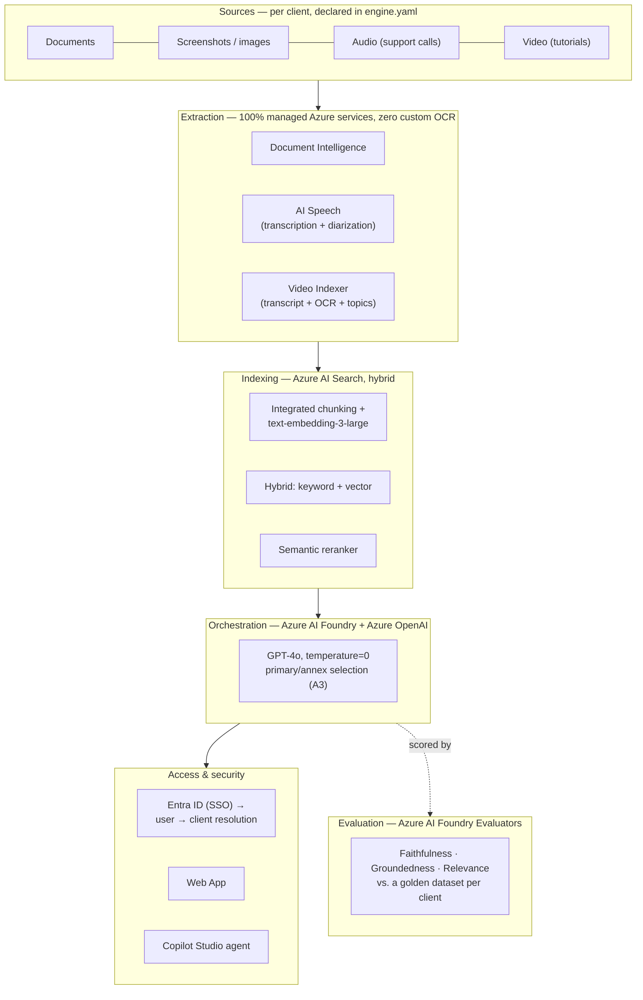

# KnowledgeEngine — Azure-native Multimodal RAG Platform

AI assistance platform for enterprise IT support, built on Azure managed services. Ingests multimodal knowledge (documents, screenshots, audio, video) from multiple client organizations in a strictly isolated multi-tenant architecture — every answer traceable, measured, and never leaked across clients.

This repository is the technical showcase: the reusable engine, the infrastructure-as-code, and three synthetic demo clients (Client A/B/C — no real client data). Fully cloud-native: extraction, indexing, orchestration, and evaluation all run on managed Azure services — no custom OCR, no self-hosted index.

## The 5 axioms

| Axiom | Principle |
|---|---|
| **A1 — Determinism** | Reproducible answers (temperature=0, pinned model versions, stable tie-breaking). |
| **A2 — Client-agnosticism** | Zero business logic in the engine; all client specifics live in an `engine.<client>.yaml`. Onboarding a client is configuration, not development. |
| **A3 — Hierarchy** | One primary record + a bounded set of annexes, selected before the LLM call. |
| **A4 — Separation of responsibilities** | Extraction → indexing → orchestration → presentation, cleanly separated services. |
| **A5 — Traceability** | Every answer audited and measured (Azure AI Foundry evaluators: Faithfulness, Groundedness, Relevance). |

## Architecture at a glance



Each client is isolated by a **dedicated Azure AI Search index** (physical isolation, not just a filter), with the `clientId` field projected onto every document as defense in depth — a user routed to one client's index technically cannot retrieve another client's records, even if the engine scored them relevant.

See [`docs/architecture.md`](docs/architecture.md) for the full technical blueprint, and [`docs/ingestion-pipeline.md`](docs/ingestion-pipeline.md) for the SharePoint → Blob → Search ingestion flow that feeds it.

## Azure stack

- **Orchestration & models**: Azure AI Foundry + Azure OpenAI (GPT-4o, `text-embedding-3-large`).
- **Indexing**: hybrid Azure AI Search (BM25 + vectors + semantic reranker), integrated vectorization.
- **Ingestion**: Logic Apps (SharePoint → Blob), zero connectors — system-assigned managed identity only.
- **Extraction** (roadmap): Document Intelligence, Speech, Video Indexer — no in-house extraction code.
- **Multi-tenant isolation**: Azure Entra ID + dedicated index per client + `clientId` security trimming.
- **Evaluation**: Azure AI Foundry evaluators (Faithfulness, Groundedness, Relevance) — reliability is measured, not assumed.

## Repository structure

```
infra/          Platform Infrastructure as Code (Bicep) — reproducible & deployable per client
  main.bicep        Orchestrator (resource group scope)
  main.bicepparam    Parameters (region, prefix)
  modules/           Modules per service (storage, search, foundry, roles)
ingestion/      SharePoint → Blob per-client ingestion (Logic App, Bicep, zero connectors)
search/         Azure AI Search pipeline templates (datasource, skillset, indexer, index)
config/         Per-client configuration (engine.yaml) — embodies axiom A2
eval/           Golden datasets & evaluation runs (Client A/B/C, synthetic)
demo/           Static demo build
kb/             Synthetic knowledge base content for the three demo clients
docs/           Architecture blueprint, ingestion pipeline diagram
```

## Deployment

```bash
az login
az account set --subscription "<your subscription>"

# 1. Platform foundation (once)
az deployment group create --resource-group <rg-name> \
  --template-file infra/main.bicep --parameters infra/main.bicepparam

# 2. Per-client Search pipeline
cd search && ./deploy.ps1 -ClientId clienta

# 3. Per-client ingestion (optional, if sourcing from SharePoint)
az deployment group create --resource-group <rg-name> \
  --template-file ingestion/main.bicep --parameters ingestion/example.parameters.json
```

Onboarding a new client never touches the engine: a new `config/engine.<client>.yaml`, a new `kb-<client>` container, and one `search/deploy.ps1 -ClientId <client>` call.

## Roadmap

| Layer | Status |
|---|---|
| Ingestion (SharePoint → Blob) | ✅ Built |
| Indexing (hybrid Azure AI Search) | ✅ Built |
| Evaluation (Foundry evaluators, golden datasets) | ✅ Built |
| Orchestration (Foundry + GPT-4o, primary/annex) | ✅ Built |
| Web App (demo interface) | ✅ Built |
| Auth & isolation (Entra ID SSO, multi-tenant, groups, security trimming) | ✅ Built |
| Copilot Studio agent | 🟢 Planned |
| Audio (Azure AI Speech) | 🟢 Planned |
| Multimodal images (verbalization + visual embeddings) | 🟢 Planned |
| Video (Azure Video Indexer) | 🟢 Planned |

---

*Designed and developed by Yassine Baba Khouya. Property of the author.*
