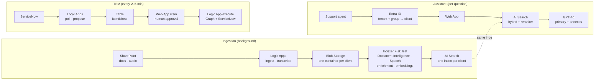

# KnowledgeEngine — Azure-native Multimodal RAG Platform

AI assistance platform for enterprise IT support, built on Azure managed services. Two capabilities share one platform:

- **Diagnostic assistant** — ingests multimodal knowledge (documents, screenshots, support-call audio, video) from multiple client organizations in a strictly isolated multi-tenant architecture, and answers support agents in a multi-turn conversation. Every answer is traceable, measured, and never leaked across clients.
- **ITSM action module** — reads ServiceNow tickets, lets GPT-4o propose one action from a closed list, filters it through deterministic guardrails, waits for a human agent's approval, then executes it in Entra ID (group access, offboarding, password reset, MFA reset) and closes the ticket.

This repository is the technical showcase: the reusable engine, the infrastructure-as-code, and three synthetic demo clients (Client A/B/C — no real client data). Fully cloud-native: extraction, indexing, orchestration, integration and evaluation all run on managed Azure services — no custom OCR, no self-hosted index, no always-on custom integration code.

A second, newer track lives alongside this showcase engine: **a deterministic diagnostic engine** (`kecore/` · `kefind/` · `scoreboard/`) where the code decides which fiche is shown — never the LLM, never the search index — and every step is verified verbatim against its source. See [`docs/v10-deterministic-engine.md`](docs/v10-deterministic-engine.md).

## The 5 axioms

| Axiom | Principle |
|---|---|
| **A1 — Determinism** | Reproducible outputs: pinned model versions, temperature=0 + fixed seed, strict `json_schema` Structured Outputs, closed action enums, rules enforced in code rather than in the prompt. |
| **A2 — Client-agnosticism** | Zero business logic in the engine; all client specifics live in an `engine.<client>.yaml`. Onboarding a client is configuration, not development. |
| **A3 — Hierarchy** | One primary text record + at most two annexes, selected by rank before the LLM call. Audio and video are never the primary source. |
| **A4 — Separation of responsibilities** | Extraction → indexing → orchestration → presentation as separate services; in ITSM, *propose*, *approve* and *execute* are three distinct identities. |
| **A5 — Traceability** | Every answer cites its sources and is measured (Azure AI Foundry evaluators: Groundedness, Relevance, Retrieval); every ITSM action is logged in the table and the ticket. |

## Architecture at a glance



Each client is isolated by a **dedicated Azure AI Search index** (physical isolation, not just a filter), with the `clientId` field projected onto every document and enforced on every query as defense in depth. Users are resolved to a client from their Entra ID tenant and security group; an unknown tenant or group sees nothing (deny-by-default).

See [`docs/architecture.md`](docs/architecture.md) for the full technical blueprint, [`docs/ingestion-pipeline.md`](docs/ingestion-pipeline.md) for the SharePoint → Blob → Search flow, [`docs/operations-runbook.md`](docs/operations-runbook.md) for deployment and operations, and [`docs/v10-deterministic-engine.md`](docs/v10-deterministic-engine.md) for the deterministic diagnostic engine track.

## Azure stack

- **Models**: Azure AI Foundry — GPT-4o (answers, ITSM proposals, screenshot vision), a separate GPT-4o deployment for enrichment, `text-embedding-3-large`.
- **Indexing**: hybrid Azure AI Search (BM25 + vectors + semantic reranker), synonym maps and entity boosting, per-client indexers and skillsets.
- **Extraction**: Document Intelligence (layout → markdown chunking), AI Speech (batch transcription with PII redaction), Video Indexer.
- **Enrichment**: one Azure Function called by the skillset (entities, aliases, summaries), with a Table Storage cache.
- **Integration**: Logic Apps with plain HTTP actions and managed identities — zero managed connectors — for SharePoint ingestion, call transcription and the three ITSM workflows.
- **App**: App Service Web App (Flask) behind Easy Auth (Entra ID), multi-turn conversations stored in Table Storage.
- **Security**: managed identities and RBAC; remaining secrets only in Key Vault; ITSM executor limited to Helpdesk Administrator; one-time delivery of temporary passwords / Temporary Access Passes through a dedicated Key Vault.
- **Evaluation**: Azure AI Evaluation SDK (Groundedness, Relevance, Retrieval) against a golden dataset per client, runs logged to the Azure AI Foundry project.

## Azure managed services used

Every runtime component is an Azure managed service: Azure runs the servers, patching, scaling and retries; the repository only holds configuration (Bicep, workflow JSON, index and skillset templates, per-client YAML).

| Managed service | Resources | Role in the platform |
|---|---|---|
| **Azure AI Foundry** (AI Services) | 1 account + 1 project | Hosts the model deployments (GPT-4o, GPT-4o for enrichment, `text-embedding-3-large`) and the cognitive services below; the project receives evaluation runs. |
| **Azure OpenAI in Foundry** | 3 deployments | Answer generation, ITSM action proposals, screenshot reading (vision), evaluation judge; embeddings for vector search. |
| **Azure AI Document Intelligence** | via Foundry | Extracts text, tables and heading structure from PDF, Word, PowerPoint and images during indexing. |
| **Azure AI Speech** | via Foundry | Batch transcription of support calls, with speaker separation. |
| **Azure AI Video Indexer** | 1 account | Transcript, on-screen text and topics from tutorial videos. |
| **Azure AI Search** | 1 service, 1 index per client | Hybrid search (BM25 + vectors + semantic reranker), indexers and skillsets that turn blobs into indexed chunks, synonym maps. |
| **Azure Logic Apps** (Consumption) | ingestion, transcription, 3 ITSM workflows | Scheduled workflows with plain HTTP actions and managed identities: SharePoint → Blob, audio → Speech, ServiceNow poll / propose / execute. |
| **Azure Functions** | 1 app | Enrichment skill called by the skillsets (entities, aliases, summaries). |
| **Azure App Service** | 1 plan (Linux) + 1 Web App | Hosts the diagnostic assistant and the `/itsm` approval tab, behind Easy Auth. |
| **Azure Storage** | 1 account | Blob: raw files per client container. Table: conversations, ITSM tickets, enrichment cache. |
| **Azure Key Vault** | 2 vaults | Integration secrets (SharePoint, Speech, ServiceNow) and one-time delivery of temporary passwords / Temporary Access Passes. |
| **Microsoft Entra ID** | tenant, groups, app registrations | Sign-in, user → client resolution by tenant and group, managed identities, target of ITSM actions through Microsoft Graph. |
| **Azure Monitor** | Log Analytics + Application Insights | Logs, performance and failures of the enrichment Function; smart-detection alerts. |

External, non-Azure: **ServiceNow** (ticket source, REST Table API) and **SharePoint Online** (client knowledge source, read through Microsoft Graph).

## Repository structure

```
infra/          Platform Infrastructure as Code (Bicep) — storage, search, Foundry, Function, Video Indexer, Web App, RBAC
ingestion/      SharePoint → Blob ingestion and audio transcription Logic Apps (Bicep, zero connectors)
search/         Azure AI Search templates (datasource, skillsets, indexers, index, synonym map) + deploy.ps1
enrichment/     Azure Function called by the skillsets (entities, aliases, summaries)
orchestration/  answer.py — retrieval, A3 primary/annex split, Structured Outputs generation, multi-turn diagnostic
app/            Web App: diagnostic assistant + /itsm approval tab (Entra ID auth, client resolution)
itsm/           ITSM Logic Apps: poll (ServiceNow → table), propose (GPT-4o + guardrails), execute (Graph + ServiceNow)
scripts/itsm/   Operator scripts: demo identities and tickets, Graph app roles, demo reset
config/         Per-client configuration (engine.<client>.yaml) and ITSM configuration (itsm.yaml)
eval/           Golden datasets and evaluation script (Client A/B/C, synthetic)
kb/             Synthetic knowledge base content for the three demo clients
demo/           Static demo build
docs/           Architecture blueprint, ingestion pipeline, operations runbook, deterministic engine track
scoreboard/     Measurement harness — replays labeled tickets, reports metrics with confidence intervals
kecore/         KB fiche decomposition into verified steps (verbatim checks, per-client writing profile + dictionary)
kefind/         Deterministic 5-step RAG built on kecore (understand · search · filter · decide · compose)
```

## Deployment

```bash
az login
az account set --subscription "<your subscription>"

# 1. Platform foundation (once)
az deployment group create --resource-group <rg-name> \
  --template-file infra/main.bicep --parameters infra/main.bicepparam

# 2. Per-client Search pipeline
cd search && ./deploy.ps1 -ClientId clienta

# 3. Per-client ingestion (optional, if sourcing from SharePoint)
az deployment group create --resource-group <rg-name> \
  --template-file ingestion/main.bicep --parameters ingestion/example.parameters.json

# 4. ITSM module (optional) — see docs/operations-runbook.md §11
az deployment group create --resource-group <rg-name> --template-file itsm/poll/main.bicep ...
```

Onboarding a new client never touches the engine: a new `config/engine.<client>.yaml`, a new `kb-<client>` container, and one `search/deploy.ps1 -ClientId <client>` call.

## Roadmap

| Layer | Status |
|---|---|
| Ingestion (SharePoint → Blob) | ✅ Built |
| Indexing (hybrid Azure AI Search, Document Intelligence, enrichment, synonyms) | ✅ Built |
| Orchestration (Foundry + GPT-4o, primary/annex) | ✅ Built |
| Evaluation (Foundry evaluators, golden datasets, runs logged to Foundry) | ✅ Built |
| Web App (demo interface) | ✅ Built |
| Auth & isolation (Entra ID SSO, multi-tenant, groups, security trimming) | ✅ Built |
| Audio (Azure AI Speech, PII redaction, call summaries) | ✅ Built |
| Iterative diagnostic (multi-turn, screenshot reading with GPT-4o vision, password redaction) | ✅ Built |
| ITSM action module (ServiceNow + Entra ID, human approval, one-time secret delivery) | ✅ Built |
| Video (Azure Video Indexer) | 🟡 Partial — service deployed, scheduled pipeline pending |
| Measurement harness + KB decomposition (`scoreboard`, `kecore`) | ✅ Built — tested on real client KB (242 fiches) |
| Deterministic RAG (`kefind`, 5-step) | ✅ Built — not yet calibrated on real labeled tickets |
| Deterministic engine, pillar 2 — dynamic per-client dictionary | 🟡 In progress — offline extraction shipped, online feedback loop pending |
| Deterministic engine, pillars 1, 3–8 | 🟢 Planned — see `docs/v10-deterministic-engine.md` |
| Copilot Studio agent | 🟢 Planned |

---

*Designed and developed by Yassine Baba Khouya. Property of the author.*
